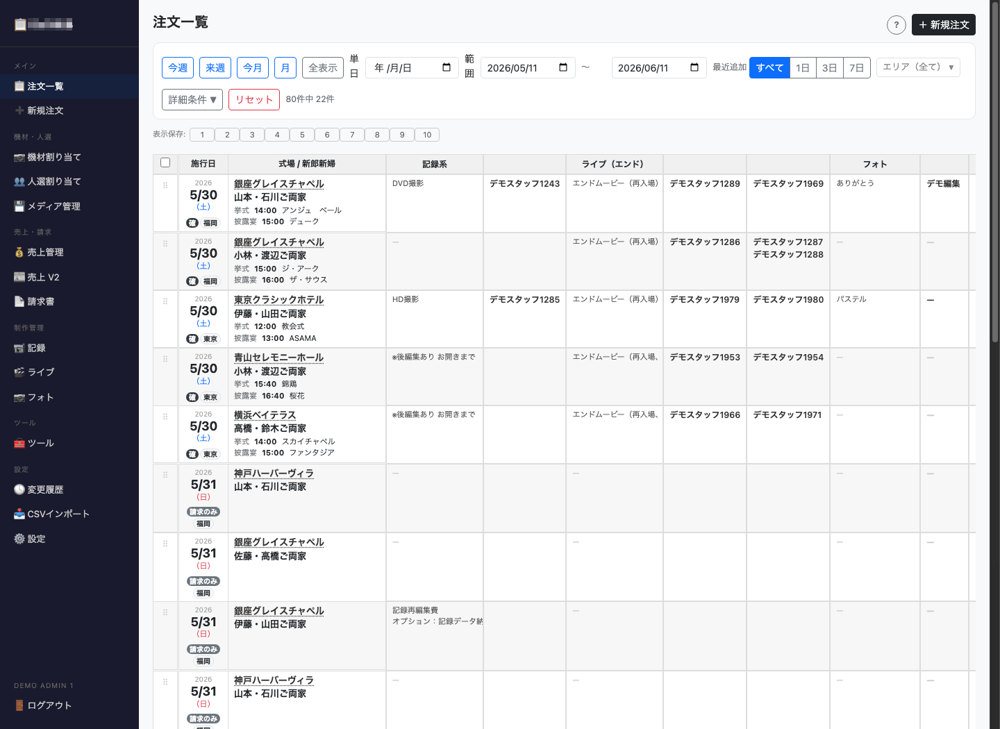
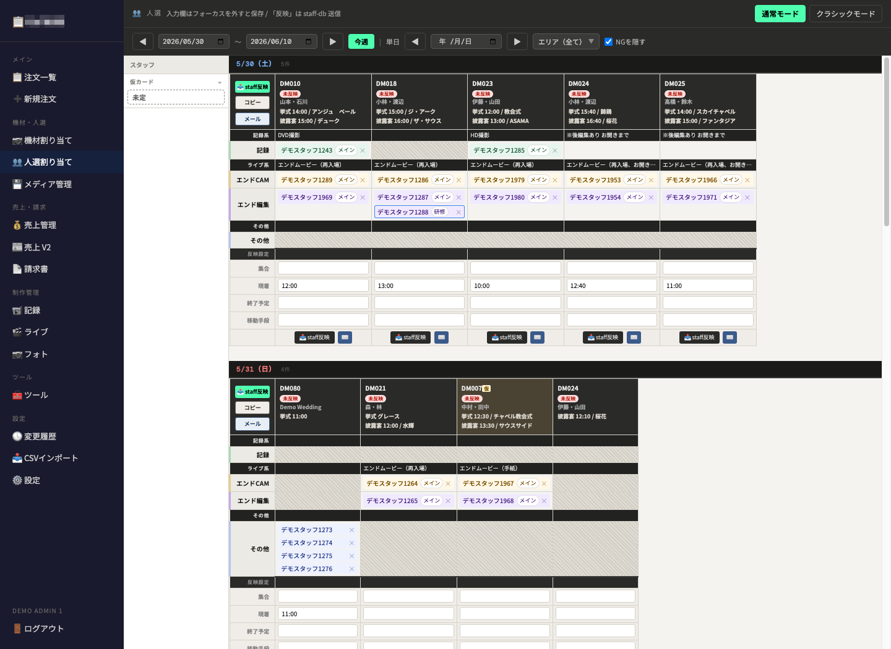
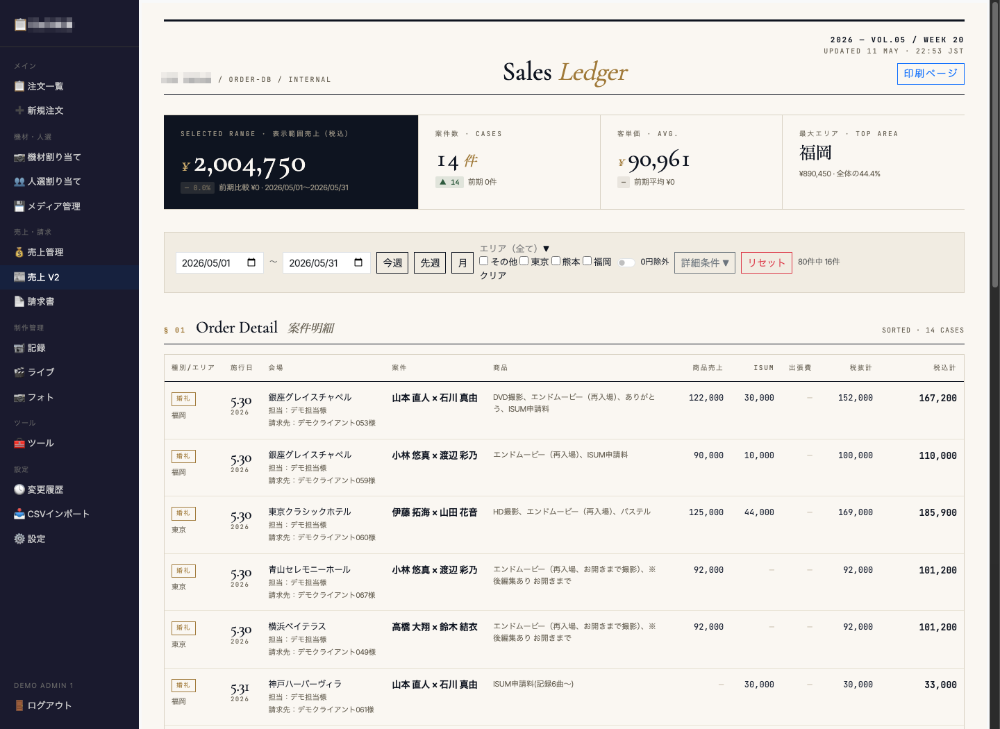
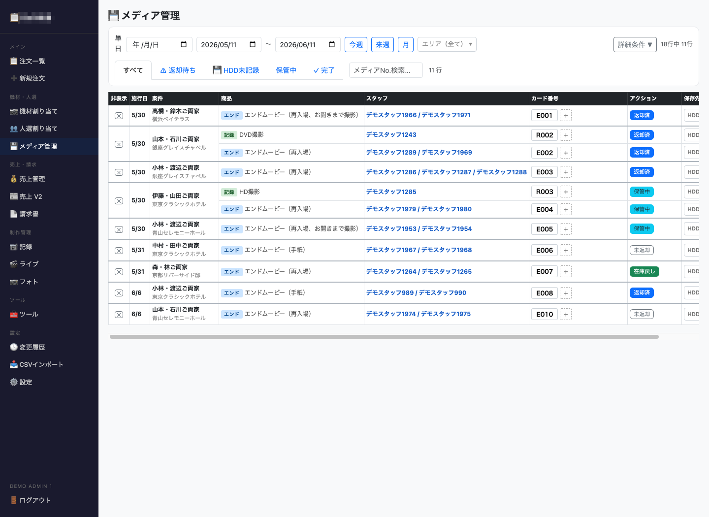
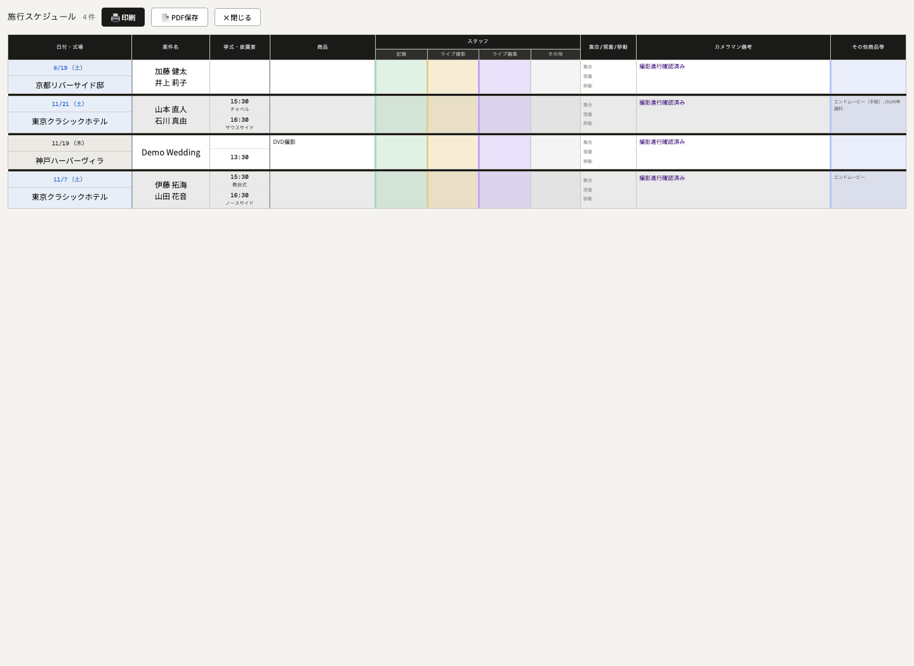

# order-db / 業務基幹システム

## 概要
映像制作会社の受注管理、人材アサイン、制作進行、売上管理、請求、メディア管理を一元化する社内業務システムです。

## 背景
少人数で複数拠点の制作業務を回す中で、案件情報・人材配置・売上・制作進行が分散し、確認コストや属人化が課題になっていました。

## 主な機能
- 注文一覧・検索・フィルタ
- 人選割り振り・タイムライン表示
- 売上管理・集計ダッシュボード
- メディア管理
- 印刷用スケジュール出力
- CSVインポート
- 各種制作進行管理

## 技術構成
- Python
- Flask
- SQLite
- JavaScript
- GitHub
- VPS / systemd

## スクリーンショット

### 注文一覧

### 人選割り振りタイムライン

### 売上管理ダッシュボード

### メディア管理

### 印刷用スケジュール

## 補足
掲載画像は、実運用中のシステムをベースに、個人情報・顧客情報・会場名・スタッフ名等をダミーデータへ置換したポートフォリオ用画面です。