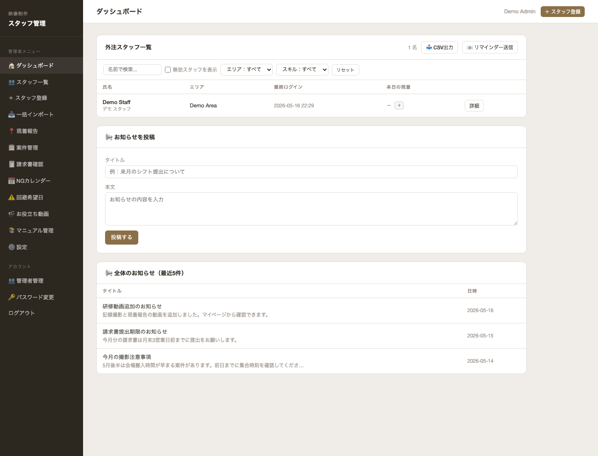
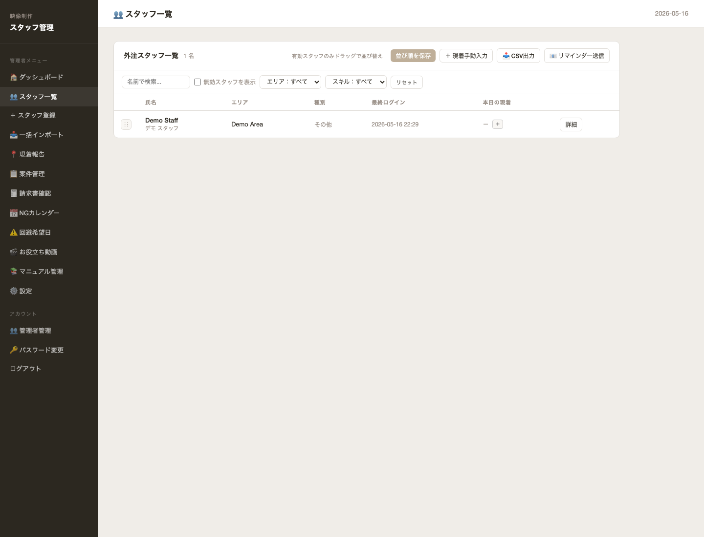
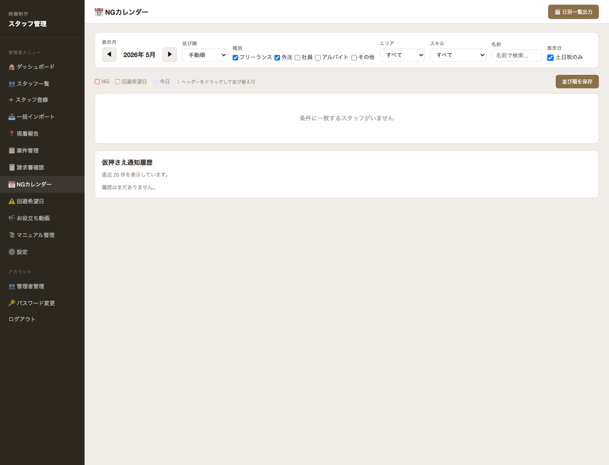
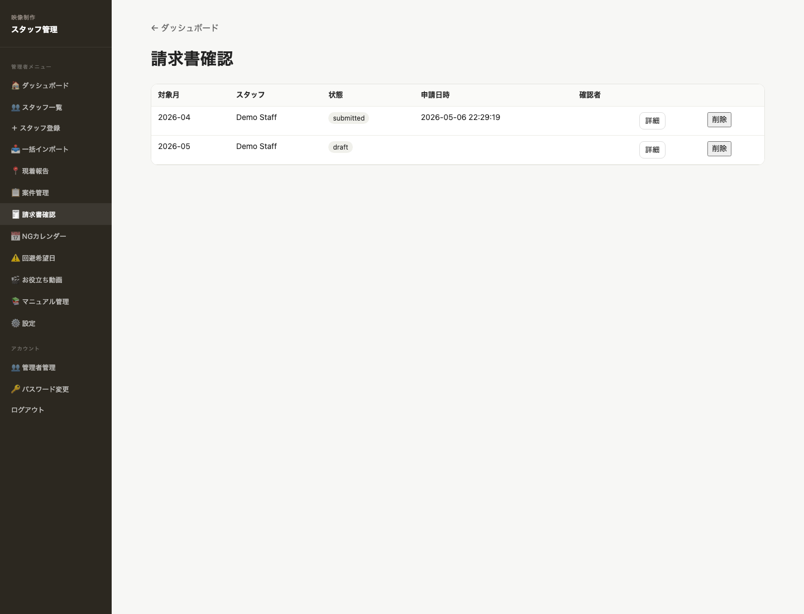
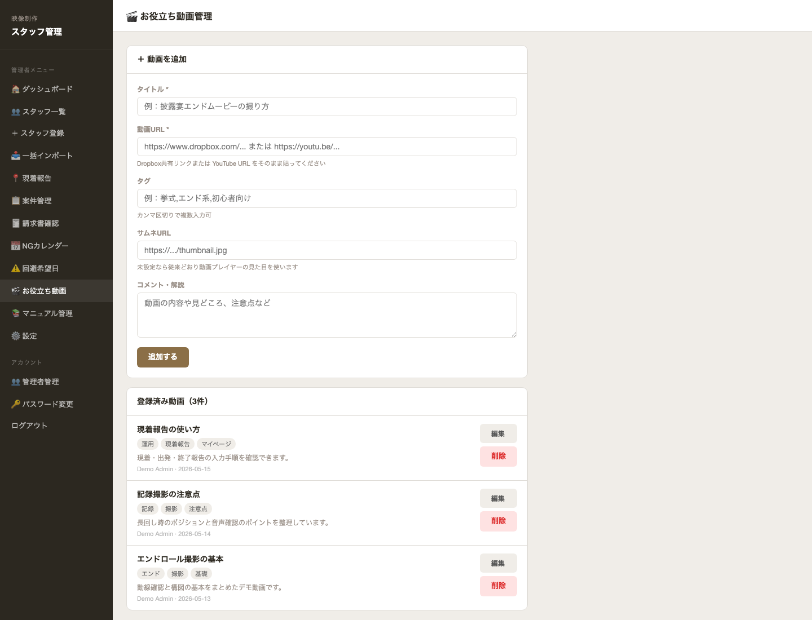
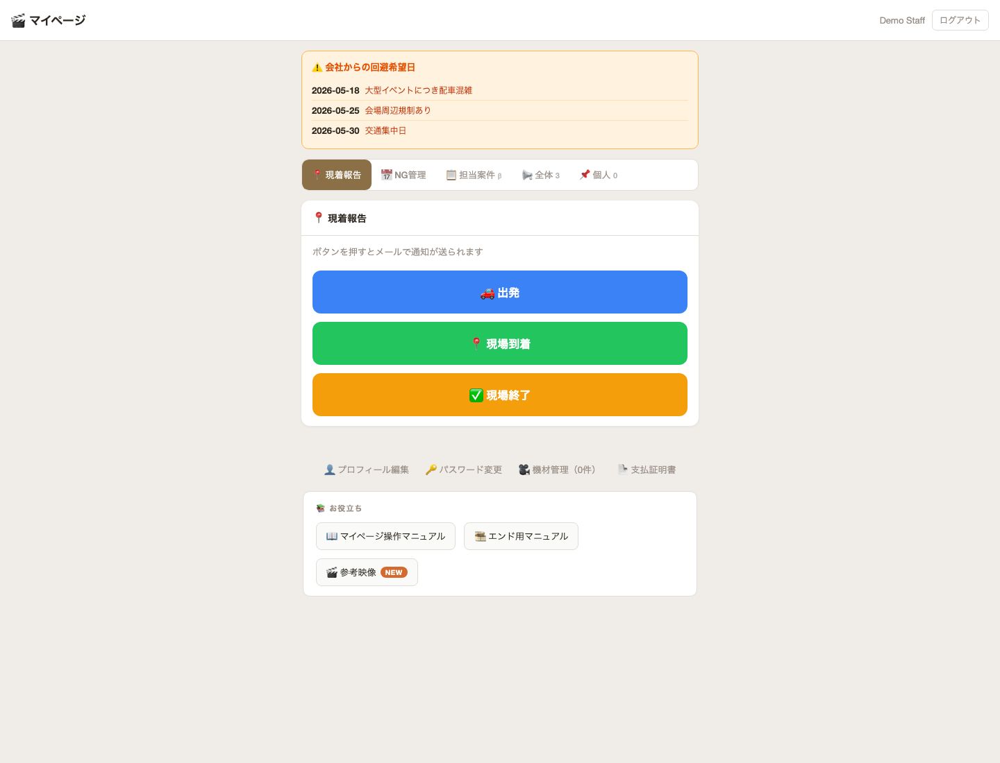
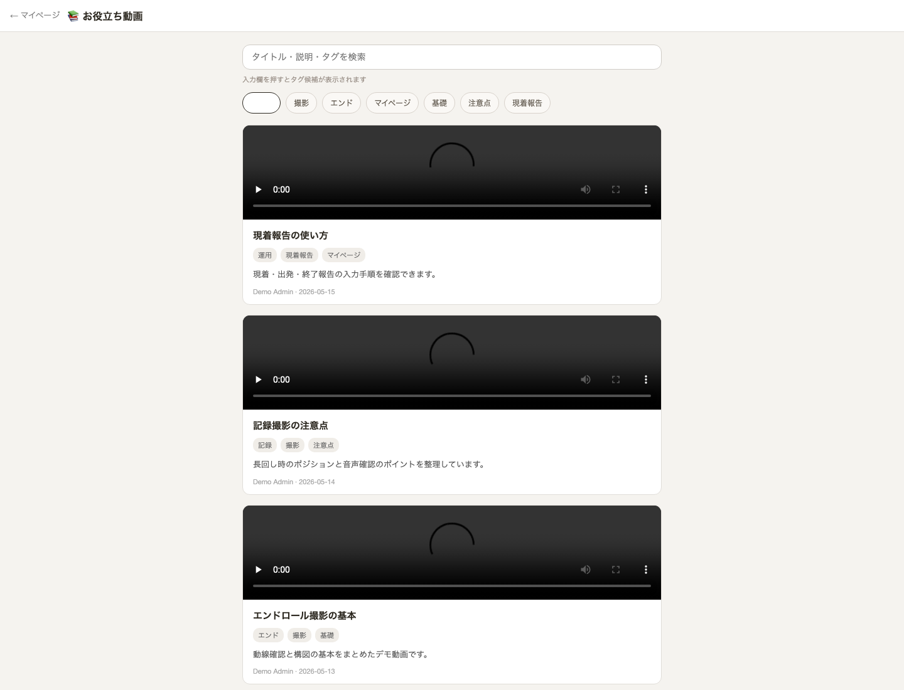
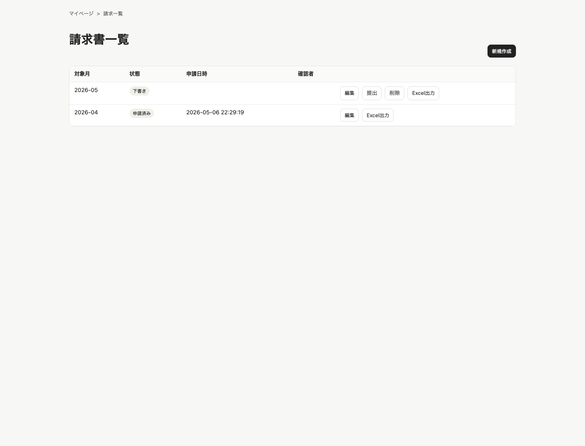

# staff-db / スタッフ業務支援システム

## 概要

外注スタッフを含む全スタッフ向けに、マイページ、申請・承認、NGカレンダー、CA請求書、研修動画、ナレッジ共有を提供する業務支援システム。

## 背景

スタッフとのやり取り、稼働可否、請求、研修情報が分散していたため、管理者・スタッフ双方の確認負荷が高かった。  
スタッフ自身が情報確認・申請・請求・学習を行える環境を整えることで、管理コスト削減と運用標準化を目指した。

## 主な機能

- スタッフマイページ
- お知らせ配信
- NG日 / 仮押さえ管理
- CA請求書の作成・提出・確認
- 管理者向け請求確認
- 研修動画 / ナレッジ共有
- スタッフ一覧・プロフィール管理

## 技術構成

- Python
- Flask
- SQLite
- HTML / CSS / JavaScript
- GitHub
- VPS / systemd

## スクリーンショット

### 管理者ダッシュボード

### スタッフ一覧

### NGカレンダー

### 管理者向けCA請求一覧

### 研修動画管理

### スタッフマイページ

### スタッフ向け研修動画

### スタッフ向けCA請求一覧

## 補足

掲載画像は、実運用中のシステムをベースに、個人情報・スタッフ情報・請求情報等をダミーデータへ置換したポートフォリオ用画面です。
